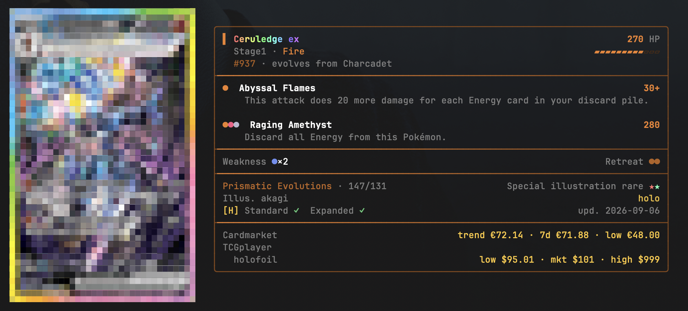

# cardex

A command line Pokemon TCG card searcher written in Rust, backed by the [TCGdex API](https://tcgdex.dev).

## Install
```sh
git clone https://github.com/jin-ramen/cardex.git
cd cardex
cargo install --path .
```

## Usage
```
cardex <COMMAND> [OPTIONS]

Commands:
  card    Show full details for a single card
  search  Search cards by name, with optional filters
  set     Show a set and list every card in it
  sets    List sets by name, all if no name is given
  help    Print this message or the help of the given subcommand(s)

Options:
  -R, --region <REGION>  Card region to query (en, fr, de, ja, ...) [default: en]
  -h, --help             Print help
```

### Examples

```sh
# find every Ceruledge
cardex search ceruledge

# full detail for one card
cardex card sv08.5-147

# search for set/s by name
cardex sets -n prismatic

# full detail for a set
cardex set sv08.5
```